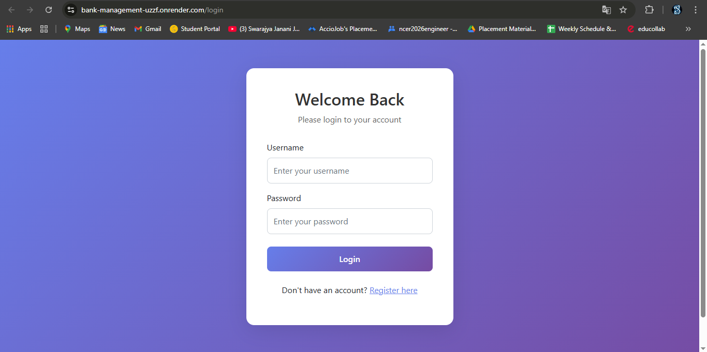
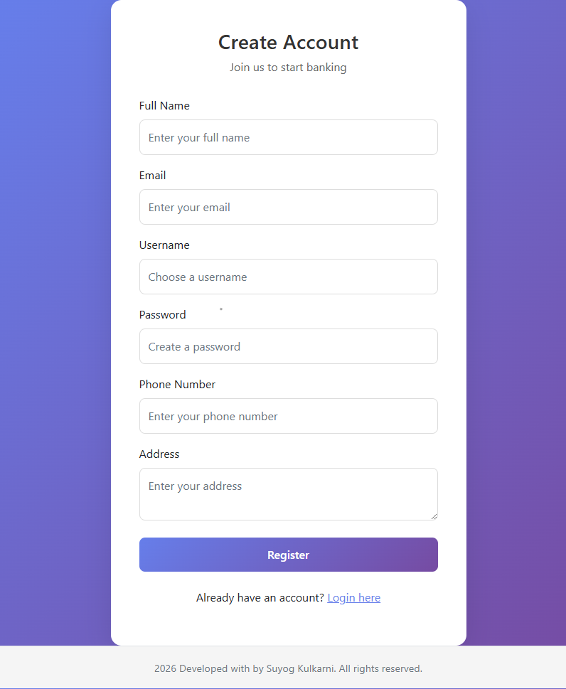
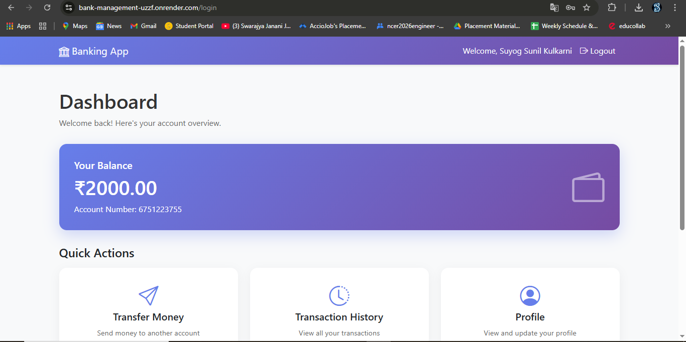
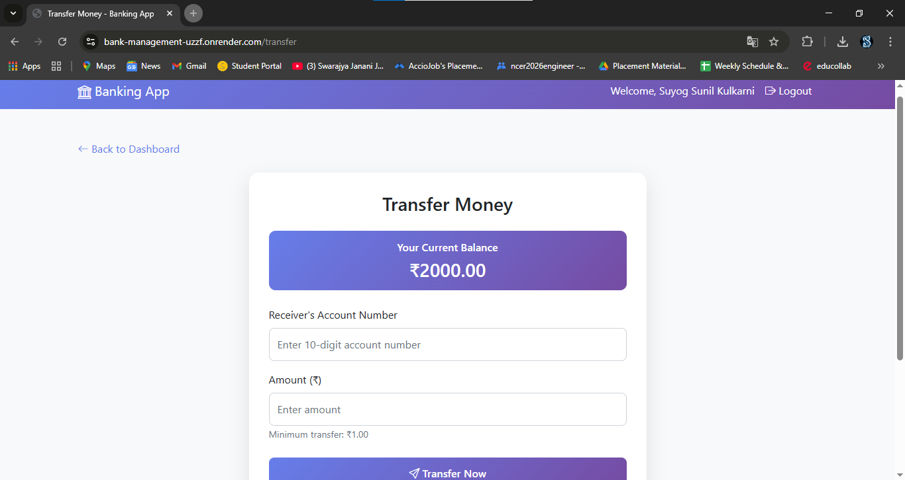
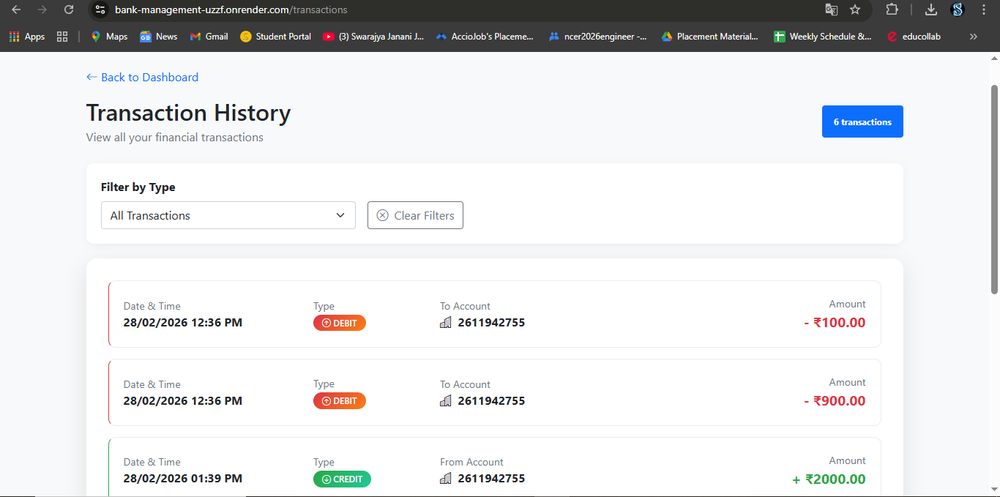
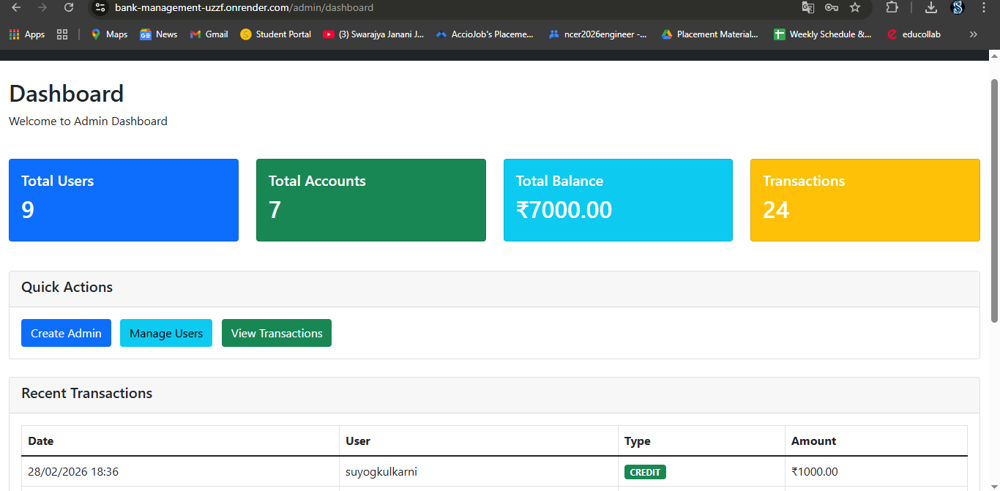
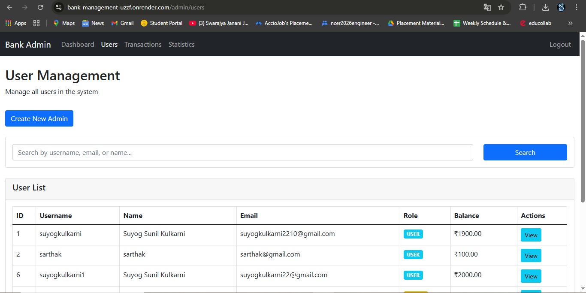
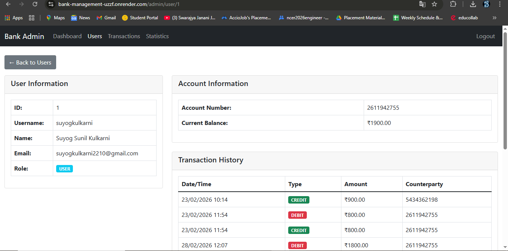
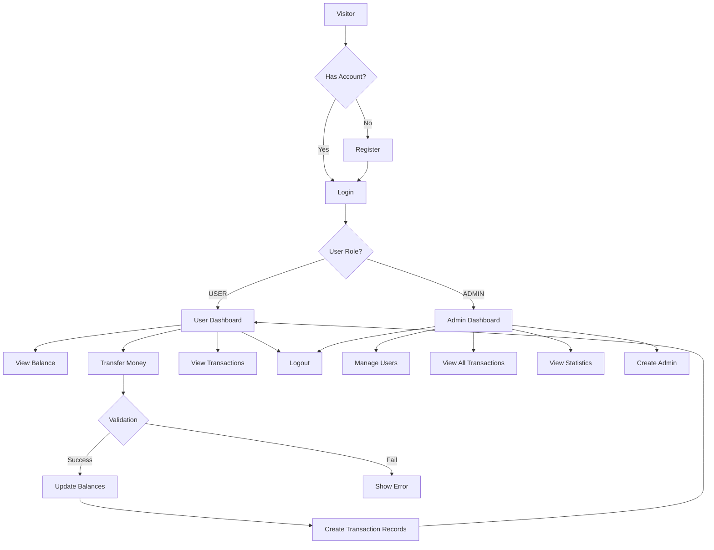

# 🏦 Banking Web Application – Spring Boot

<p align="center">
  
  
  
  
  
  
  
</p>

<p align="center">
  💻 Full-Stack Banking System with Secure Login, Admin Panel, Money Transfer & Transaction Tracking
</p>

---

## 🚀 Live Demo

🔗 **Click here to use the application:**
👉 **[https://bank-management-uzzf.onrender.com/](https://bank-management-uzzf.onrender.com/)**

---

## 📸 Application Screenshots

### 🔐 Login Page


### 📝 User Registration


### 📊 User Dashboard


### 💸 Money Transfer


### 📜 User Transaction History


### 👑 Admin Dashboard


### 👥 User Management (Admin)


### 📊 Admin Transaction View


### 👤 User Details (Admin)


---

## ✨ Features

### 👤 User Features
* **User Registration & Login** - Secure sign-up with email/username validation
* **Personal Dashboard** - View account balance and personal information
* **Money Transfer** - Send money to other accounts with real-time validation
* **Transaction History** - View all debit/credit transactions with timestamps
* **Profile Management** - View account details and personal information

### 👑 Admin Features
* **Admin Dashboard** - System-wide statistics overview
* **User Management** - View all users with search and pagination
* **Transaction Monitoring** - View all system transactions with filters
* **Admin Creation** - Create new admin users directly from dashboard
* **User Details** - View individual user accounts and their transactions

### 🔒 Security Features
* **Session-based Authentication** - Secure login/logout with session management
* **Password Encryption** - BCrypt password encoding for security
* **Role-based Access** - Separate USER and ADMIN role protection
* **Input Validation** - Prevent invalid transactions and duplicate registrations
* **Session Timeout** - Automatic session handling

---

## 🛠️ Tech Stack

| Layer           | Technology                                    |
| --------------- | --------------------------------------------- |
| Backend         | Java 17, Spring Boot 3.x, Spring Data JPA, Hibernate |
| Security        | Spring Security 6.x, BCrypt Password Encoder   |
| Frontend        | Thymeleaf, HTML5, CSS3, Bootstrap 5, Bootstrap Icons |
| Database        | PostgreSQL (Production), H2 (Local Testing)   |
| Build Tool      | Maven                                         |
| Version Control | Git & GitHub                                  |
| Deployment      | Render (Cloud Platform)                       |
| IDE             | VS Code / IntelliJ IDEA                       |

---

## 📂 Project Structure

```
banking-app/
│
├── src/main/java/banking_app/
│   ├── controller/
│   │   ├── UserController.java        # User authentication & operations
│   │   ├── AdminController.java        # Admin panel controllers
│   │   ├── ApiController.java          # REST API endpoints
│   │   ├── HomeController.java          # Home page routing
│   │   └── SetupController.java         # Initial setup utilities
│   │
│   ├── entity/
│   │   ├── User.java                    # User entity with role
│   │   ├── Account.java                  # Bank account entity
│   │   └── Transaction.java               # Transaction entity
│   │
│   ├── repository/
│   │   ├── UserRepository.java
│   │   ├── AccountRepository.java
│   │   └── TransactionRepository.java
│   │
│   └── config/
│       ├── SecurityConfig.java            # Spring Security config
│       └── PasswordConfig.java             # BCrypt encoder config
│
├── src/main/resources/
│   ├── templates/
│   │   ├── login.html
│   │   ├── register.html
│   │   ├── dashboard.html                   # User dashboard
│   │   ├── transfer.html
│   │   ├── transactions.html
│   │   └── admin/
│   │       ├── dashboard.html                # Admin dashboard
│   │       ├── users.html                     # User management
│   │       ├── user-details.html               # Single user view
│   │       ├── transactions.html               # All transactions
│   │       ├── statistics.html                  # System stats
│   │       └── create-admin.html                 # Create admin form
│   │
│   └── application.properties
│
├── pom.xml
└── README.md
```

---

## ⚙️ How to Run Locally

### Prerequisites
- Java 17 or higher
- Maven
- PostgreSQL (optional, H2 works for testing)

### 1️⃣ Clone Repository
```bash
git clone https://github.com/suyogkulkarni2210/banking-app.git
cd banking-app
```

### 2️⃣ Configure Database (Optional)
Edit `src/main/resources/application.properties`:
```properties
# For local H2 database (default)
spring.datasource.url=jdbc:h2:mem:bankingdb
spring.h2.console.enabled=true

# OR for PostgreSQL
# spring.datasource.url=jdbc:postgresql://localhost:5432/banking_db
# spring.datasource.username=postgres
# spring.datasource.password=yourpassword
```

### 3️⃣ Build Project
```bash
mvn clean install
```

### 4️⃣ Run Application
```bash
mvn spring-boot:run
```

### 5️⃣ Open in Browser
```
http://localhost:8080
```

### 6️⃣ Default Admin Access
Visit `/setup` or `/force-create-admin` to create an admin user:
- Username: `admin`
- Password: `admin123`

---

## 🔄 Application Flow



---

## ✅ Validations Implemented

### User Registration
- ✅ Username uniqueness check
- ✅ Email uniqueness check
- ✅ Password encryption with BCrypt

### Login
- ✅ Username existence verification
- ✅ Password matching with BCrypt
- ✅ Session management

### Money Transfer
- ✅ Receiver account existence
- ✅ Sufficient balance check
- ✅ Positive amount validation
- ✅ Transaction recording (debit/credit)

### Admin Operations
- ✅ Session-based admin verification
- ✅ Pagination for user lists
- ✅ Search functionality
- ✅ Role-based access control

---

## 🔮 Future Enhancements

- [ ] **Email Notifications** - Send email receipts for transactions
- [ ] **Two-Factor Authentication** - Enhanced security
- [ ] **Mobile App** - REST API for mobile clients
- [ ] **Transaction Filters** - Filter by date, amount, type
- [ ] **Export Reports** - PDF/Excel export of transactions
- [ ] **Account Statements** - Monthly account statements
- [ ] **Password Reset** - Forgot password functionality
- [ ] **Profile Picture Upload** - User avatars
- [ ] **Transaction Limits** - Daily transfer limits
- [ ] **Multi-currency Support** - Different currency accounts

---

## 🐛 Known Issues & Fixes

| Issue | Solution |
|-------|----------|
| `@Transient` fields causing errors | Removed from entity, using separate queries |
| Admin login not working | Fixed session attribute check in AdminController |
| Transaction totals not showing | Added Thymeleaf aggregation in template |
| 500 error on dashboard | Added null checks in templates |
| Account number generation | Added unique validation with while loop |

---

## 👨‍💻 Author

**Suyog Kulkarni**

📧 [suyogkulkarni2210@gmail.com](mailto:suyogkulkarni2210@gmail.com)

🔗 **GitHub:** [https://github.com/suyogkulkarni2210](https://github.com/suyogkulkarni2210)

🔗 **LinkedIn:** [https://www.linkedin.com/in/suyog-kulkarni-048011246](https://www.linkedin.com/in/suyog-kulkarni-048011246)

---

## 📝 License

This project is open source and available under the [MIT License](LICENSE).

---

## ⭐ Show Your Support

If you like this project:

- ⭐ **Star** the repository on GitHub
- 🍴 **Fork** it to contribute
- 📢 **Share** it with others
- 💬 **Provide feedback** for improvements

---

## 📊 Project Status

✅ **User Authentication** - Complete  
✅ **Money Transfer** - Complete  
✅ **Transaction History** - Complete  
✅ **Admin Panel** - Complete  
✅ **User Management** - Complete  
✅ **Database Integration** - Complete  
✅ **Deployment on Render** - Complete  

---
